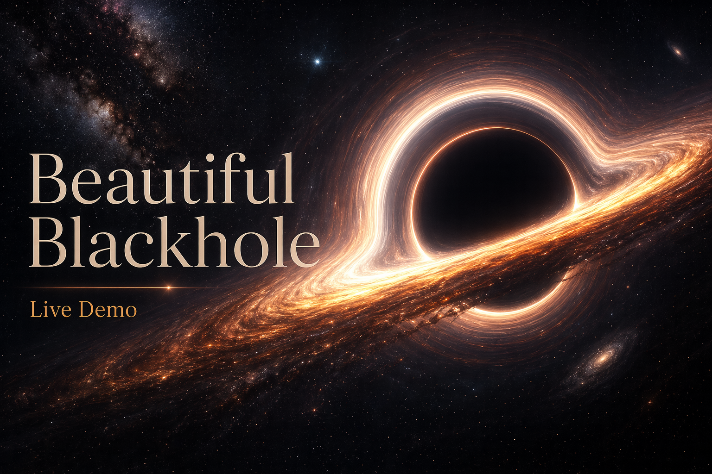
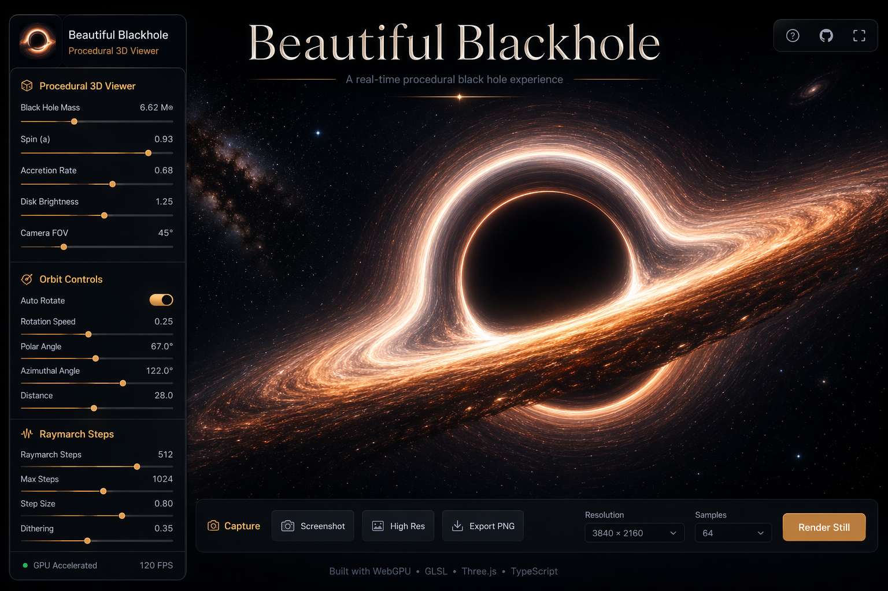
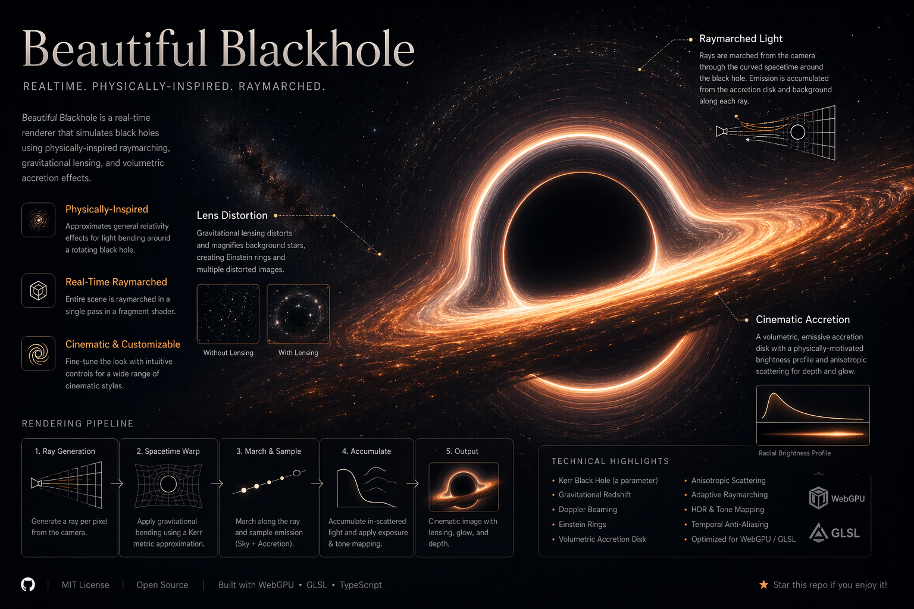

# Beautiful Blackhole

<p align="center">
  <a href="https://smturtle2.github.io/beautiful-blackhole/">
    
  </a>
</p>

<p align="center">
  <a href="https://smturtle2.github.io/beautiful-blackhole/"><strong>Open Live Demo</strong></a>
  ·
  <a href="https://github.com/smturtle2/beautiful-blackhole/actions/workflows/deploy.yml">Deployment</a>
  ·
  <a href="#run-locally">Run locally</a>
</p>

<p align="center">
  <a href="https://smturtle2.github.io/beautiful-blackhole/">
    
  </a>
  
  
  
</p>

**Beautiful Blackhole** is a cinematic black hole viewer built as a procedural 3D artwork surface. It focuses on the overwhelming Interstellar-like feeling of a warped accretion structure, lens-distorted light, orbitable camera motion, and a compact side control panel for tuning the final look.

## Live Demo

The deployed app is here:

### [https://smturtle2.github.io/beautiful-blackhole/](https://smturtle2.github.io/beautiful-blackhole/)

Click the banner above or the link here to open the viewer directly.

## Preview



## Highlights

- Procedural 3D black hole artwork rendered in the browser with Three.js and GLSL.
- Raymarched light field with tunable step count up to `256`.
- Orbit controls with separate yaw and pitch auto-rotation speeds.
- Adjustable lensing, spin, disk light, inclination, exposure, star field, glare, and motion.
- Compact collapsible side panel so the artwork stays visually dominant.
- One-click capture flow for saving the current view.
- GitHub Pages deployment through GitHub Actions.

## Rendering Direction



The renderer is designed as visual artwork rather than a strict astrophysics simulator. The goal is a dramatic browser-native black hole scene with:

- gravitational lensing arcs around the event horizon,
- glowing accretion light that wraps around the center,
- distorted star fields,
- continuous drag orbiting,
- cinematic presets for different moods.

## Run Locally

```bash
npm install
npm run dev
```

Open `http://localhost:5173/`.

## Build

```bash
npm run lint
npm run build
```

The production build outputs to `dist/`.

## Deploy

This repo deploys to GitHub Pages on every push to `main`.

- Workflow: `.github/workflows/deploy.yml`
- Pages URL: `https://smturtle2.github.io/beautiful-blackhole/`
- Vite base path: `/beautiful-blackhole/`

## Tech Stack

- React
- TypeScript
- Vite
- Three.js
- GLSL fragment shader rendering
- GitHub Actions + GitHub Pages
